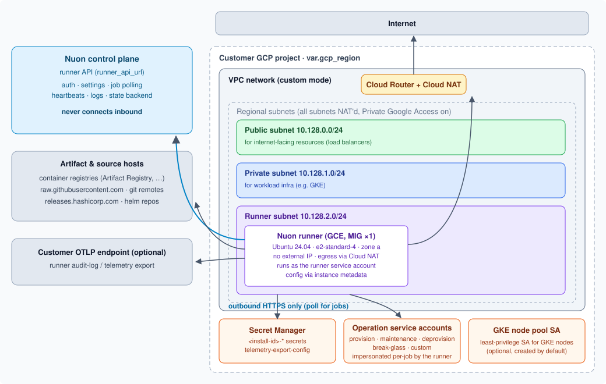

# GCP install stack template

This is a Terraform module for provisioning Nuon install stacks in GCP. It is meant to be applied by a customer against their own GCP project. It provisions a dedicated VPC network and a Compute Engine instance to host the Nuon runner. The runner polls the Nuon control plane for jobs and executes them locally by impersonating scoped service accounts.

For more information about Nuon stack templates, see the [Stack templates](../docs/stack-templates.md) doc.

For more information about the Nuon runner, see the [Nuon runner requirements](../docs/runner-requirements.md) doc.

## Architecture

## Resources

- **APIs** (`services.tf`) – Enables the project services the stack and its workloads need (Compute, IAM, Secret Manager, GKE, Cloud DNS, Artifact Registry, Cloud SQL, Storage, and more); none are disabled on destroy.
- **VPC & subnets** (`network.tf`) – A dedicated custom-mode VPC with regional public, private, and runner subnets (all with Private Google Access enabled), a Cloud Router, and a Cloud NAT covering all subnets for outbound internet access.
- **Firewall rules** (`network.tf`) – All TCP/UDP/ICMP traffic allowed between addresses inside the VPC CIDR; all egress allowed to `0.0.0.0/0`. No inbound-from-internet rule exists.
- **Runner** (`runner.tf`) – An instance template + single-instance managed instance group (zone `<region>-a`, proactive replace on update) running Ubuntu 24.04 on an `e2-standard-4` (configurable via `runner_machine_type`) with a 30 GB pd-balanced boot disk and no external IP. The instance runs as the runner service account with `cloud-platform` scope and reads its configuration from instance metadata.
- **IAM** (`iam.tf`) –
  - **Runner service account** with a custom role granting `compute.instances.get`, so the control plane can verify the instance's identity during runner auth. The runner holds no standing workload permissions itself.
  - **Operation service accounts**, each granting the runner `roles/iam.serviceAccountTokenCreator` so it can impersonate them per-job. Permissions come from custom roles (one per named policy, a map of permission strings) and/or a predefined role (e.g. `roles/editor`). Each is created only if the customer allows:
    - **provision** – used by provision workflows and secret syncs
    - **maintenance** – used by everything else (the default)
    - **deprovision** – used by deprovision workflows
  - **Break-glass service accounts** – optional, created from a map keyed by role name and gated by `enabled = true`.
  - **Custom service accounts** – optional app-operation roles, same shape and gating as break-glass roles.
  - **GKE node pool service account** – a least-privilege SA for GKE nodes (logging, monitoring, Artifact Registry read), created by default; pass `gke_node_pool_sa_email` to use an existing one instead, or set `has_gke_node_pool = false` to skip it.
- **Secrets** (`secrets.tf`) – Secret Manager entries named `<install-id>-<name>` for auto-generated secrets (63-char random values) and customer-provided secrets, plus an **empty** `<install-id>-telemetry-export-config` secret whose value the customer uploads out-of-band (see [Telemetry export](../docs/runner-requirements.md#telemetry-export-optional)).
- **Phone home** (`phone_home.tf`) – A `local-exec` provisioner that POSTs provisioning results (outputs, install inputs) back to Nuon on every apply.

> [!NOTE]
> Because service account IDs are capped at 30 characters and don't support labels, the break-glass and custom SAs are named by a deterministic hash of the install ID and role name; the legible role name lives in the SA's display name and description.

## Network topology

| Network        | CIDR            | Scope    | Notes                                          |
| -------------- | --------------- | -------- | ---------------------------------------------- |
| VPC            | custom mode     | global   | no auto-created subnets                        |
| Public subnet  | `10.128.0.0/24` | regional | for internet-facing resources (load balancers) |
| Private subnet | `10.128.1.0/24` | regional | for workload infra (e.g. GKE)                  |
| Runner subnet  | `10.128.2.0/24` | regional | hosts the runner instance                      |

- Unlike AWS, GCP subnets are **regional**, so there is one subnet per tier rather than one per availability zone. Zonal redundancy comes from GCP's regional fabric, not from subnet layout.
- A single **Cloud NAT** (auto-allocated IPs) attached to the Cloud Router provides outbound internet access for **all** subnets — there is no public/private routing split; "public" vs "private" is a naming convention consumed by downstream components.
- All subnets have **Private Google Access** enabled, so instances without external IPs can still reach Google APIs (Secret Manager, Compute, Artifact Registry) directly.
- The runner requires no inbound connectivity; for the outbound destinations it must reach, see [Runner requirements → Network requirements](../docs/runner-requirements.md#network-requirements).

## Authentication

On GCP, the runner authenticates with a **static API token**: the customer exports `TF_VAR_runner_api_token` (provided by the vendor) and the instance template's startup script passes it to the runner as `NUON_RUNNER_API_TOKEN`. See the [root README](../README.md#gcp) for usage.

The bootstrap process is as follows.

1. The startup script exports `NUON_RUNNER_ID`, `NUON_RUNNER_API_URL`, `NUON_RUNNER_API_TOKEN`, and `NUON_INSTALL_ID`, then downloads and runs the init script from `runner_init_script_url`, retrying until it succeeds (the script is idempotent).
1. The same values are also set as instance metadata (`nuon_runner_id`, `nuon_runner_api_url`, `nuon_install_id`) — the GCP mirror of the AWS instance tags.
1. The runner service account holds `compute.instances.get` so the control plane can independently read the instance's `nuon_runner_id` metadata when verifying the runner's identity (used by the newer `init-mng-v2` auth flow, where the runner fetches its own token and `runner_api_token` is not needed).
